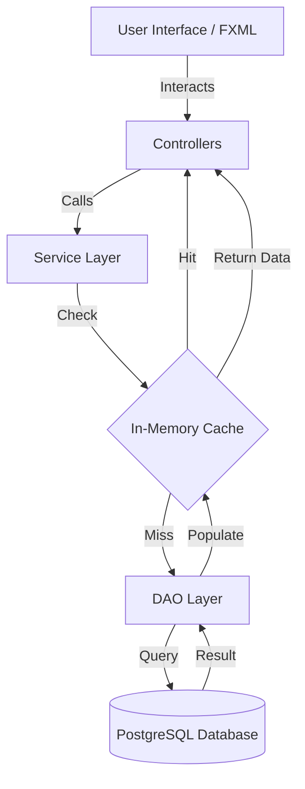

# ShopJoy Visual & Data Flow

This document outlines the user interaction paths and the underlying data architecture of the ShopJoy E-Commerce System.

## 1. Application Entry & Authentication
1.  **Launch**: `ShopJoyApp` initializes the primary stage.
2.  **Login/Register**:
    - User interacts with `login.fxml` or `register.fxml`.
    - `UserService` performs BCrypt verification via `UserDAO`.
3.  **Role-Based Routing**:
    - **Admin**: Redirected to `admin_dashboard.fxml`.
    - **Customer**: Redirected to `customer_dashboard.fxml`.

## 2. Customer Experience Flow
The customer journey focus is on discovery and frictionless checkout.

- **Discovery**: 
    - Browsing categories (recursive tree built via `CategoryService` using cached data).
    - Searching products (keyword search utilizing `ProductCache` for sub-millisecond results).
- **Purchase**:
    - **Cart**: Items managed in a local `ObservableList`.
    - **Checkout**: `CheckoutDialog` collects shipping/payment info.
    - **Transaction**: `OrderService` creates the `Order`, maps `OrderItems`, and triggers `InventoryService` to deduct stock levels.

## 3. Admin Management Flow
The admin interface is modular, loading views dynamically into a central content area.

- **Management Modules**:
    - **Products**: CRUD operations that automatically synchronize with `ProductCache`.
    - **Categories**: Visual hierarchy management.
    - **Inventory**: Real-time stock monitoring and replenishment.
    - **Orders**: Status tracking (Pending -> Processing -> Shipped -> Delivered).
- **Data Integrity**: 
    - Every modification (Add/Update/Delete) triggers a targeted cache invalidation to ensure data consistency across the app.

## 4. Technical Data Flow Architecture
The application follows a strictly layered approach to ensure scalability and performance.

## 5. Performance Optimization Layer
- **Warm-up**: `CacheManager` proactively loads top-level categories and featured products on startup.
- **Background Refresh**: A scheduled executor refreshes the cache every 4-10 minutes to maintain freshness without blocking the UI thread.
- **Non-Blocking Checks**: Cache validity checks use `volatile` timestamps to ensure the JavaFX thread never hangs during heavy processing.
